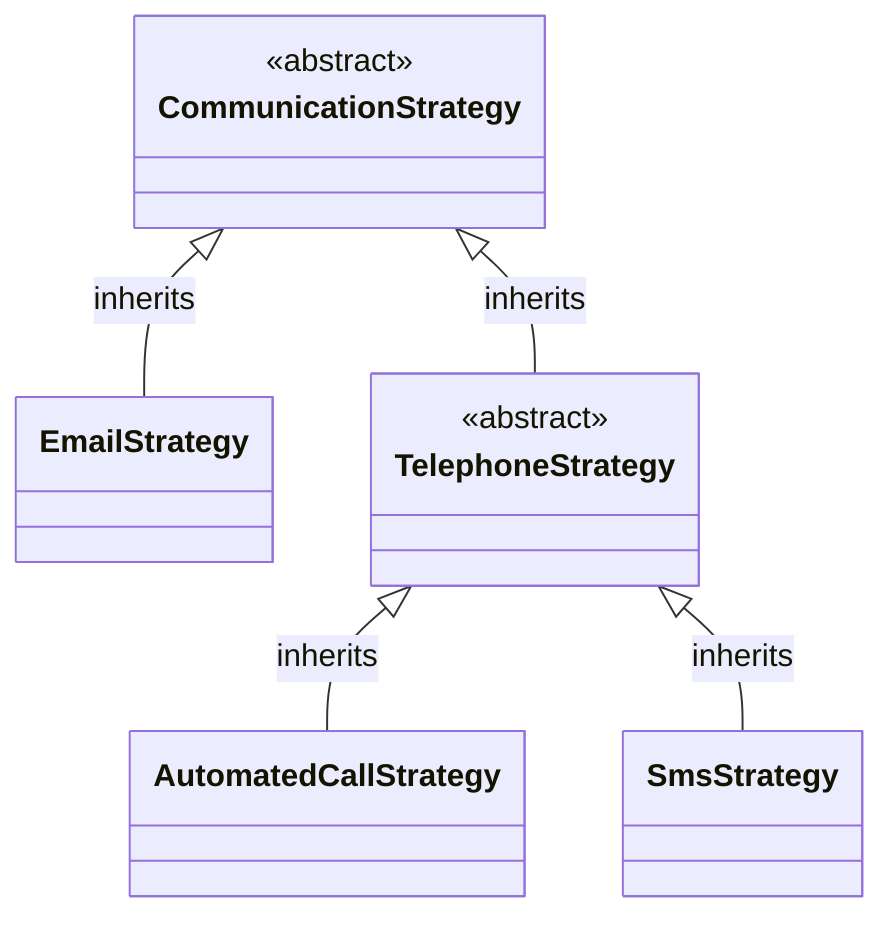
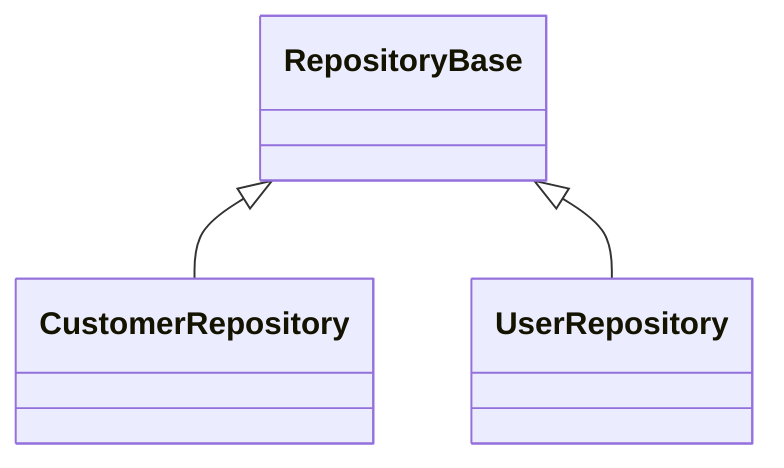
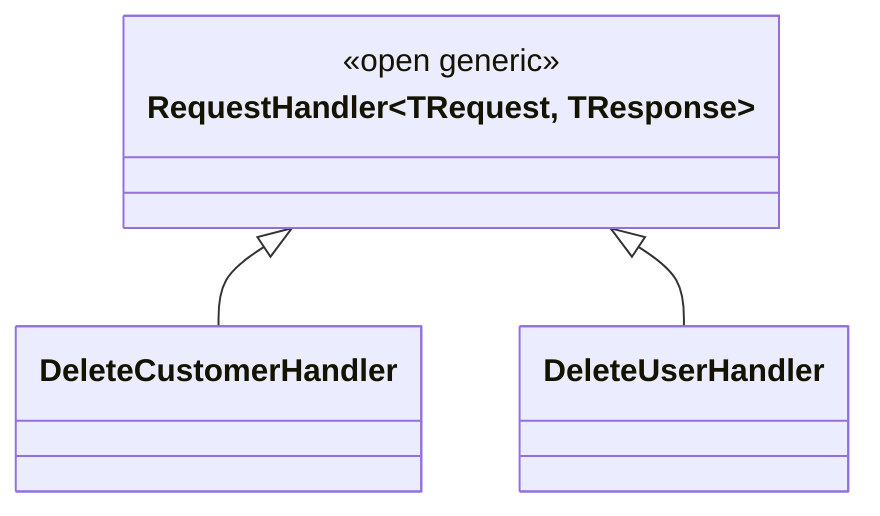
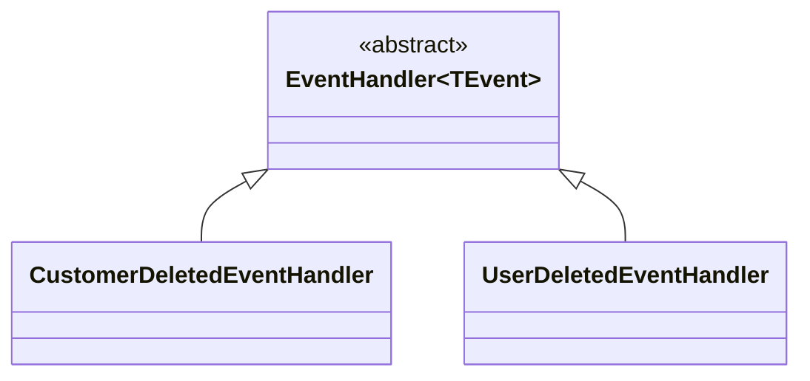

# RegisterClassesDescendedFrom

Finds all concrete classes descending from the
specified `BaseClass` and registers them.

## Signature
```c#
required Type BaseClass,
required ServiceLifetime ServiceLifetime,
required ClassAs As,
optional string? ClassRegex
```

## Scenario 1: Register using the base class as the service key

### Manually written code
```c#
[RegisterClassesDescendedFrom(typeof(CommunicationStrategy), ServiceLifetime.Scoped, ClassAs.BaseClass)]
public partial class MyModule : RoslynjectModule
{
}

public abstract class CommunicationStrategy {}
public class EmailStrategy : CommunicationStrategy {}
public abstract class TelephoneStrategy : CommunicationStrategy {}
public class AutomatedCallStrategy : TelephoneStrategy {}
public class SmsStrategy : TelephoneStrategy {}
```



### Generated code
```c#
partial class Module
{
   static partial void AfterRegister(IServiceCollection services);
        
   public static void Register(IServiceCollection services)
   {
      services.AddScoped(typeof(CommunicationStrategy), typeof(EmailStrategy));
      services.AddScoped(typeof(CommunicationStrategy), typeof(SmsStrategy));
      services.AddScoped(typeof(CommunicationStrategy), typeof(AutomatedCallStrategy));

      AfterRegister(services);
   }
}
```

## Scenario 2: Register using descendant classes as the service key

### Manually written code
```c#
[RegisterClassesDescendedFrom(typeof(RepositoryBase), ServiceLifetime.Scoped, ClassAs.DescendantClass)]
public partial class MyModule : RoslynjectModule
{
}

public abstract class RepositoryBase {}
public class CustomerRepository : RepositoryBase {}
public class UserRepository : RepositoryBase {}
```



### Generated code
```c#
partial class Module
{
   static partial void AfterRegister(IServiceCollection services);
        
   public static void Register(IServiceCollection services)
   {
      services.AddScoped(typeof(CustomerRepository));
      services.AddScoped(typeof(UserRepository));

      AfterRegister(services);
   }
}
```

## Scenario 3: Register using open generic base class as the service key

### Manually written code
```c#
[RegisterClassesDescendedFrom(typeof(RepositoryBase), ServiceLifetime.Scoped, ClassAs.BaseClass)]
public partial class MyModule : RoslynjectModule
{
}

public abstract class RequestHandler<TRequest, TResponse> {}
public class DeleteCustomerHandler : RequestHandler<DeleteCustomerCommand, DeleteCustomerResponse> {}
public class DeleteUserHandler : RequestHandler<DeleteUserCommand, DeleteUserResponse> {}
```



### Generated code
```c#
partial class Module
{
   static partial void AfterRegister(IServiceCollection services);
        
   public static void Register(IServiceCollection services)
   {
      services.AddScoped(typeof(RequestHandler<,>), typeof(DeleteCustomerHandler));
      services.AddScoped(typeof(RequestHandler<,>), typeof(DeleteUserHandler));

      AfterRegister(services);
   }
}
```

## Scenario 4: Register using first non open-generic base class as the service key

### Manually written code
```c#
[RegisterClassesDescendedFrom(typeof(EventHandler<>), ServiceLifetime.Scoped, ClassAs.BaseOrClosedGenericClass)]
public partial class MyModule : RoslynjectModule
{
}

public abstract class EventHandler<TEvent> {}
public class CustomerDeletedEventHandler : EventHandler<CustomerDeletedEvent> {}
public class UserDeletedEventHandler : EventHandler<UserDeletedEvent> {}
```



### Generated code
```c#
partial class Module
{
   static partial void AfterRegister(IServiceCollection services);
        
   public static void Register(IServiceCollection services)
   {
      services.AddScoped(typeof(EventHandler<CustomerDeletedEvent>), typeof(DeleteCustomerHandler));
      services.AddScoped(typeof(EventHandler<UserDeletedEvent>), typeof(DeleteCustomerHandler));

      AfterRegister(services);
   }
}
```
