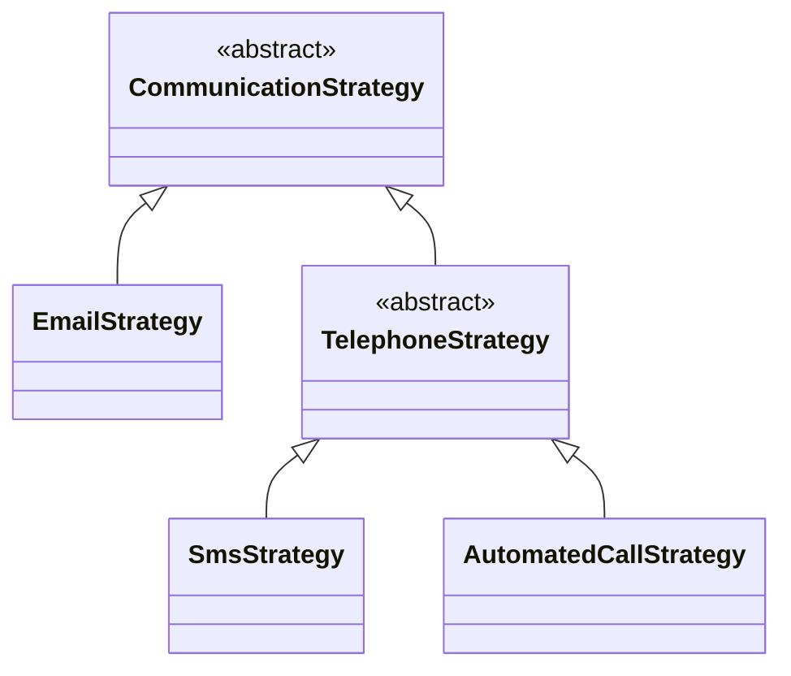
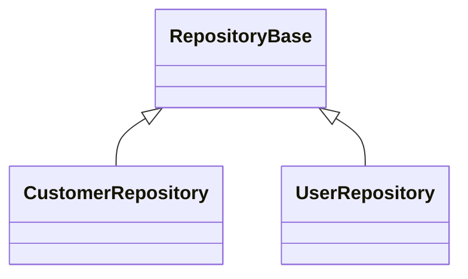

# RegisterClassesDescendedFrom

Finds all concrete classes descending from the
specified `BaseClass` and registers them.

## Scenario 1: Register using the base class as the service key

### Manually written code
```c#
[RegisterClassesDescendedFrom(typeof(BaseClass), ServiceLifetime.Scoped, ClassAs.BaseClass)]
public partial class MyModule : RoslynjectModule
{
}

public abstract class CommunicationStrategy {}
public class EmailStrategy : BaseClass {}
public abstract class TelephoneStrategy : BaseClass {}
public class SmsStrategy : TelephoneStrategy {}
public class AutomatedCallStrategy : TelephoneStrategy {}
```




### Generated code
```c#
partial class Module
{
   static partial void AfterRegister(IServiceCollection services);
        
   public static void Register(IServiceCollection services)
   {
      services.AddScoped(typeof(CommunicationStrategy), typeof(EmailStrategy));
      services.AddScoped(typeof(CommunicationStrategy), typeof(SmsStrategy));
      services.AddScoped(typeof(CommunicationStrategy), typeof(AutomatedCallStrategy));

      AfterRegister(services);
   }
}
```

## Scenario 2: Register using descendant classes as the service key

### Manually written code
```c#
[RegisterClassesDescendedFrom(typeof(RepositoryBase), ServiceLifetime.Scoped, ClassAs.DescendantClass)]
public partial class MyModule : RoslynjectModule
{
}

public abstract class RepositoryBase {}
public class CustomerRepository : RepositoryBase {}
public class UserRepository : RepositoryBase {}
```




### Generated code
```c#
partial class Module
{
   static partial void AfterRegister(IServiceCollection services);
        
   public static void Register(IServiceCollection services)
   {
      services.AddScoped(typeof(CustomerRepository
      services.AddScoped(typeof(UserRepository));

      AfterRegister(services);
   }
}
```
