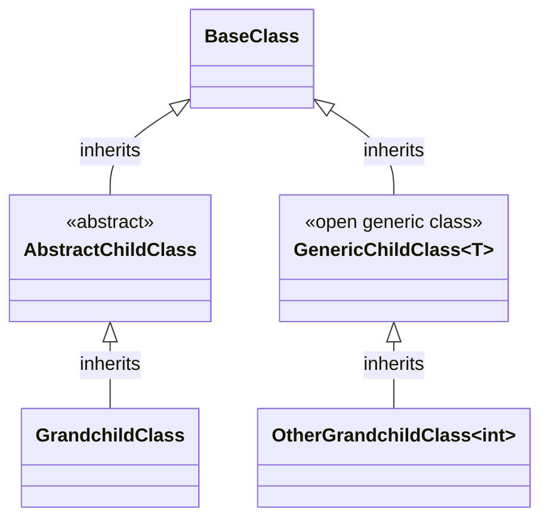

# RegisterClassesDescendedFrom

Finds all concrete classes descending from the
specified `BaseClass` and registers them.

```c#
services.AddScoped(typeof(DiscoveredClass));
```

## Example
### Manually written code
```c#
[RegisterClassesDescendedFrom(typeof(BaseClass), ServiceLifetime.Scoped)]
public partial class MyModule : RoslynjectModule
{
}
```

### Class diagram



### Generated code
```c#
partial class Module
{
   static partial void AfterRegister(IServiceCollection services);
        
   public static void Register(IServiceCollection services)
   {
      services.AddScoped(typeof(GrandchildClass));
      services.AddScoped(typeof(OtherGrandchildClass));

      AfterRegister(services);
   }
}
```

## Excluded classes
| Class | Reason |
| - | - |
| AbstractChildClass | Abstract |
| GenericChildClass&lt;T&gt; | Open generic class |
