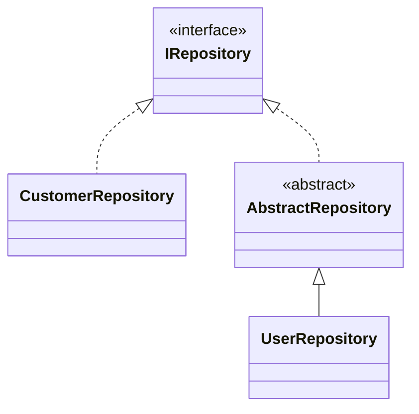

# RegisterClassesWithMarkerInterface

Finds all concrete classes that implement the
specified `IMarker` interface and registers the
class using the class type as the service
key.

* Interfaces descending from `IMarker` do <u>not</u> qualify.
* Open-generic interfaces are not permitted.

## Scenario 1: Register all classes implementing IRepository

### Manually written code
```c#
[RegisterClassesDescendedFrom(typeof(IRepository), ServiceLifetime.Scoped)]
public partial class MyModule : RoslynjectModule
{
}

public interface IRepository {}
public class CustomerRepository : IRepository {}
public abstract class AbstractRepository : IRepository {}
public class UserRepository : AbstractRepository {}
```




### Generated code
```c#
partial class Module
{
   static partial void AfterRegister(IServiceCollection services);
        
   public static void Register(IServiceCollection services)
   {
      services.AddScoped(typeof(CustomerRepository));
      services.AddScoped(typeof(UserRepository));

      AfterRegister(services);
   }
}
```

