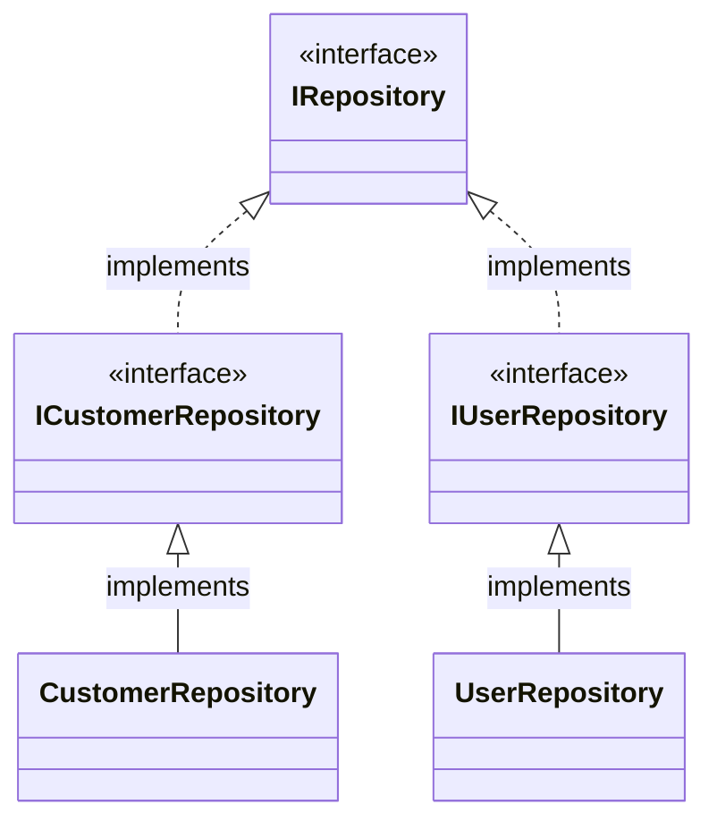
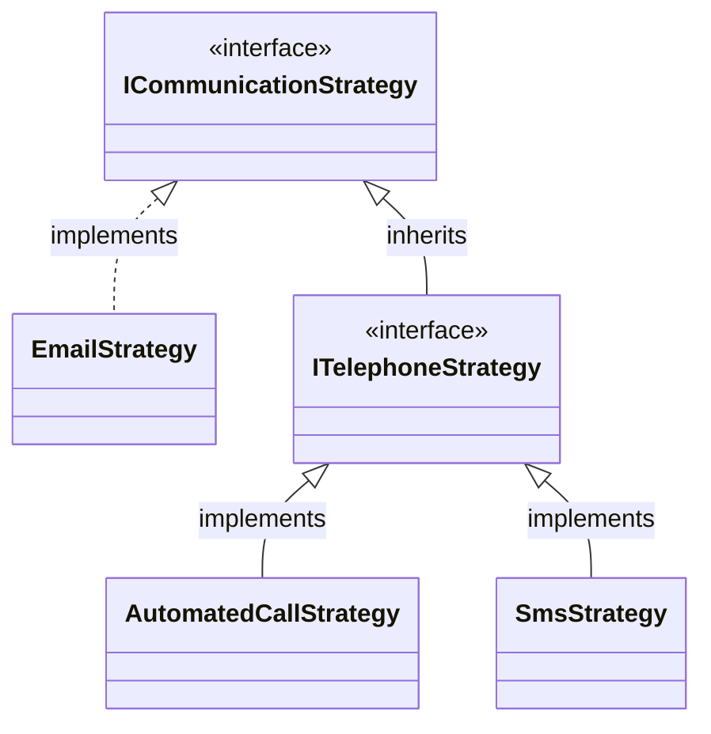
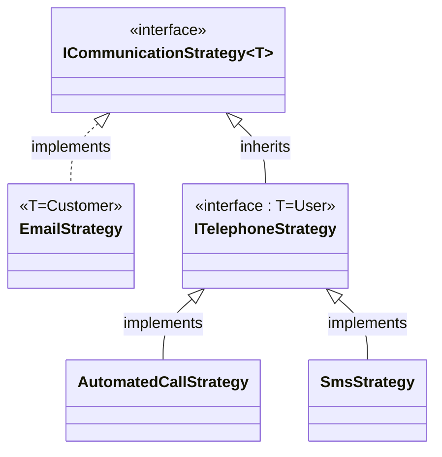

# RegisterInterfacesOfType

Finds all concrete classes that implement the
specified interface (or descendants)
and registers them using the
interface as the service key.

## Signature
```c#
required Type BaseInterface,
required ServiceLifetime ServiceLifetime,
required InterfaceAs As,
optional string? InterfaceRegex
```

## Scenario 1: Register implemented interfaces
```c#
[RegisterInterface(typeof(ICommunicationStrategy), ServiceLifetime.Scoped, typeof(ICommunicationStrategy), InterfaceAs.ImplementedInterface)]
public partial class MyModule : RoslynjectModule
{
}

public interface IRepository {}
public interface ICustomerRepository : IRepository {}
public interface IUserRepository : IRepository {}

public class CustomerRepository : ICustomerRepository {}
public class UserRepository : IUserRepository {}
```

### Class diagram


### Generated code
```c#
partial class Module
{
   static partial void AfterRegister(IServiceCollection services);
        
   public static void Register(IServiceCollection services)
   {
      services.AddScoped(typeof(ICustomerRepository), typeof(CustomerRepository));
      services.AddScoped(typeof(IUserRepository), typeof(UserRepository));

      AfterRegister(services);
   }
}
```

## Scenario 2: Register base interface
```c#
[RegisterInterface(typeof(ICommunicationStrategy), ServiceLifetime.Scoped, typeof(ICommunicationStrategy), InterfaceAs.BaseInterface)]
public partial class MyModule : RoslynjectModule
{
}

public interface ICommunicationStrategy {}
public interface ITelephoneStrategy : ICommunicationStrategy {}

public class EmailStrategy : ICommunicationStrategy {}
public class AutomatedCallStrategy : ITelephoneStrategy {}
public class SmsStrategy : ITelephoneStrategy {}
```

### Class diagram


### Generated code
```c#
partial class Module
{
   static partial void AfterRegister(IServiceCollection services);
        
   public static void Register(IServiceCollection services)
   {
      services.AddScoped(typeof(ICommunicationStrategy), typeof(EmailStrategy));
      services.AddScoped(typeof(ICommunicationStrategy), typeof(AutomatedCallStrategy));
      services.AddScoped(typeof(ICommunicationStrategy), typeof(SmsStrategy));

      AfterRegister(services);
   }
}
```

## Scenario 3: Register base or closed-generic interface
The same as registering as the `BaseInterface` except when the
base interface is an open-generic it will instead
register as a closed generic interface.

```c#
[RegisterInterface(typeof(ICommunicationStrategy<>), ServiceLifetime.Scoped, InterfaceAs.BaseOrClosedGenericInterface)]
public partial class MyModule : RoslynjectModule
{
}

public interface ICommunicationStrategy<T> {}
public interface ITelephoneStrategy : ICommunicationStrategy<User> {}

public class EmailStrategy : ICommunicationStrategy<Customer> {}
public class AutomatedCallStrategy : ITelephoneStrategy {}
public class SmsStrategy : ITelephoneStrategy {}
```

### Class diagram


### Generated code
```c#
partial class Module
{
   static partial void AfterRegister(IServiceCollection services);
        
   public static void Register(IServiceCollection services)
   {
      services.AddScoped(typeof(ICommunicationStrategy<Customer>), typeof(EmailStrategy));
      services.AddScoped(typeof(ICommunicationStrategy<User>), typeof(AutomatedCallStrategy));
      services.AddScoped(typeof(ICommunicationStrategy<User>), typeof(SmsStrategy));

      AfterRegister(services);
   }
}
```
