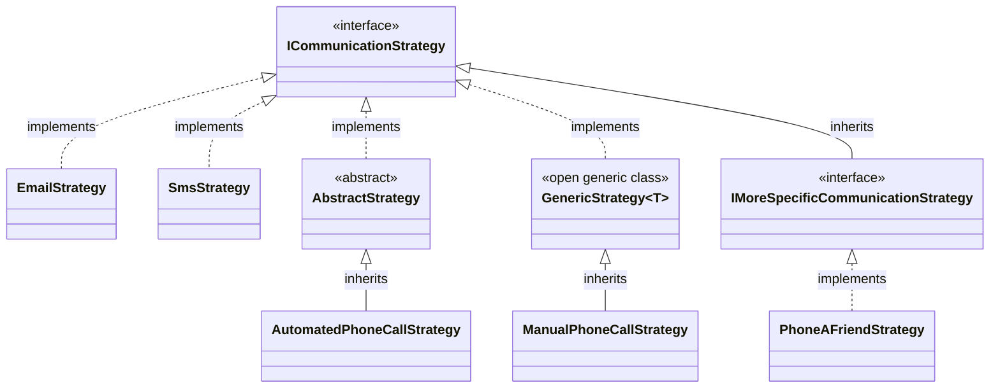

# RegisterInterfacesOfType

Finds all concrete classes that implement the
specified interface (or descendants)
and registers them using the
interface as the service key.

## Signature
```c#
required Type BaseInterface,
required ServiceLifetime ServiceLifetime,
required InterfaceAs As,
optional string? InterfaceRegex
```

## Example
### Manually written code
```c#
[RegisterInterface(typeof(ICommunicationStrategy), ServiceLifetime.Scoped, typeof(ICommunicationStrategy), InterfaceAs.BaseInterface)]
public partial class MyModule : RoslynjectModule
{
}
```

### Class diagram


### Generated code
```c#
partial class Module
{
   static partial void AfterRegister(IServiceCollection services);
        
   public static void Register(IServiceCollection services)
   {
      services.AddScoped(typeof(ICommunicationStrategy), typeof(EmailStrategy));
      services.AddScoped(typeof(ICommunicationStrategy), typeof(SmsStrategy));
      services.AddScoped(typeof(ICommunicationStrategy), typeof(AutomatedPhoneCallStrategy));
      services.AddScoped(typeof(ICommunicationStrategy), typeof(ManualPhoneCallStrategy));

      AfterRegister(services);
   }
}
```

### Excluded classes
| Class | Reason |
| - | - |
| AbstractStrategy | Abstract |
| GenericStrategy&lt;T&gt; | Open generic class |
| PhoneAFriendStrategy | Implements descendent interface |
