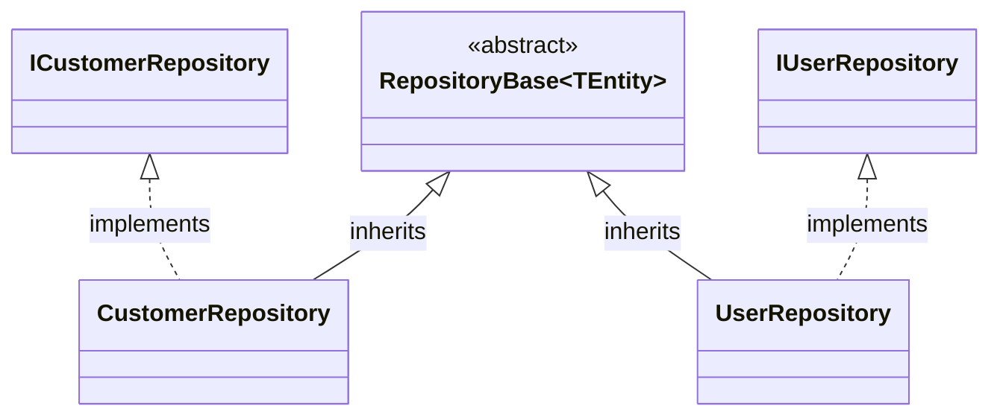

# RegisterInterfacesOnClassesDescendedFrom

Finds all concrete classes descending from the
specified `BaseClass`, then registers every interface
it implements as a service key with the class as the
service implementer.

**Note** : If not null, only interfaces with a fullname matching
`InterfaceRegex` will be registered.

## Signature
```c#
required Type BaseClass,
required ServiceLifetime ServiceLifetime,
string? InterfaceRegex
```

## Scenario 1 : All interfaces

### Manually written code
```c#
[RegisterClassesDescendedFrom(typeof(RepsitoryBase), ServiceLifetime.Scoped)]
public partial class MyModule : RoslynjectModule
{
}

public abstract class RepositoryBase<TEntity> {}
public interface ICustomerRepository {}
public interface IUserRepository {}

public class CustomerRepository : RepositoryBase<Customer>, ICustomerRepository {}
public class CustomerRepository : RepositoryBase<User>, IUserRepository {}
```



### Generated code
```c#
partial class Module
{
   static partial void AfterRegister(IServiceCollection services);
        
   public static void Register(IServiceCollection services)
   {
      services.AddScoped(typeof(ICustomerRepository), typeof(CustomerRepository));
      services.AddScoped(typeof(IUserRepository), typeof(UserRepository));

      AfterRegister(services);
   }
}
```