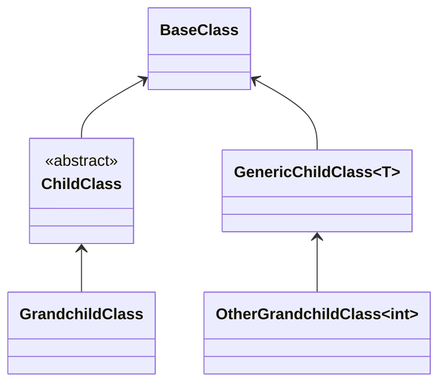

# RegisterClassesDescendingFrom

## Manually written code
```c#
[RegisterClassesDescendedFrom(ServiceLifetime.Scoped, typeof(BaseClass))]
public partial class MyModule : RoslynjectModule
{
}
```

## Class diagram



## Generated code
```c#
partial class Module
{
   static partial void AfterRegister(IServiceCollection services);
        
   public static void Register(IServiceCollection services)
   {
      services.AddScoped(typeof(GrandchildClass));
      services.AddScoped(typeof(OtherGrandchildClass));

      AfterRegister(services);
   }
}
```

## Excluded classes
| Class | Reason |
|
| ChildClass | Abstract |
| GenericChildClass&lt;T&gt; | Open generic class |
