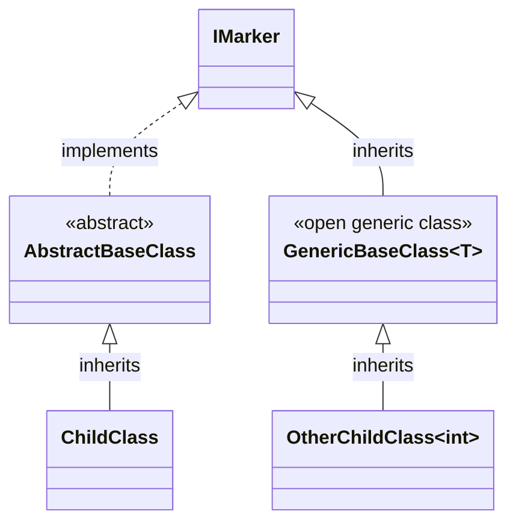

# RegisterClassesWithMarkerInterface

Finds all concrete classes descending from the
specified `IMarker` and registers them.

```c#
services.AddScoped(typeof(DiscoveredClass));
```

## Example
### Manually written code
```c#
[RegisterClassesWithMarkerInterface(ServiceLifetime.Scoped, typeof(IMarker))]
public partial class MyModule : RoslynjectModule
{
}
```

### Class diagram



### Generated code
```c#
partial class Module
{
   static partial void AfterRegister(IServiceCollection services);
        
   public static void Register(IServiceCollection services)
   {
      services.AddScoped(typeof(ChildClass));
      services.AddScoped(typeof(OtherChildClass));

      AfterRegister(services);
   }
}
```

## Excluded classes
| Class | Reason |
|
| AbstractBaseClass | Abstract |
| GenericBaseClass&lt;T&gt; | Open generic class |
