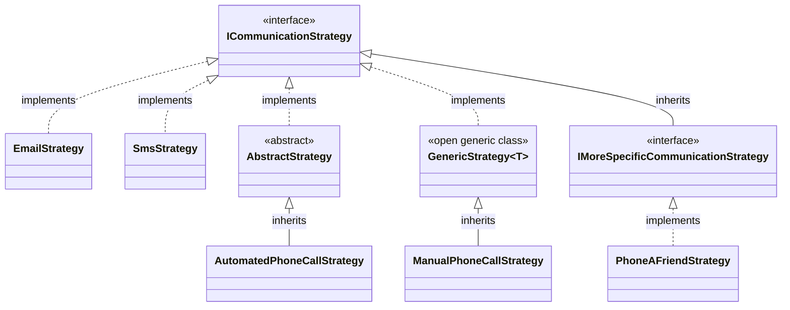

# RegisterInterfaces

Finds all concrete classes that implement the exact
interface specified and registers them using the
specified interfaces as the service key.

```c#
services.AddScoped(typeof(ICommunicationStrategy), typeof(DiscoveredClass));
```

## Restrictions
The specified interface type may not be an open generic.

| Type | Valid |
|
| IInterface&lt;&gt; | No |
| IInterface | Yes |
| IInterface&lt;User&gt; | Yes |

## Example
### Manually written code
```c#
[RegisterInterfaces(ServiceLifetime.Scoped, typeof(ICommunicationStrategy))]
public partial class MyModule : RoslynjectModule
{
}
```

### Class diagram


### Generated code
```c#
partial class Module
{
   static partial void AfterRegister(IServiceCollection services);
        
   public static void Register(IServiceCollection services)
   {
      services.AddScoped(typeof(ICommunicationStrategy), typeof(EmailStrategy));
      services.AddScoped(typeof(ICommunicationStrategy), typeof(SmsStrategy));
      services.AddScoped(typeof(ICommunicationStrategy), typeof(AutomatedPhoneCallStrategy));
      services.AddScoped(typeof(ICommunicationStrategy), typeof(ManualPhoneCallStrategy));

      AfterRegister(services);
   }
}
```

### Excluded classes
| Class | Reason |
|
| AbstractStrategy | Abstract |
| GenericStrategy&lt;T&gt; | Open generic class |
| PhoneAFriendStrategy | Implements descendent interface |
